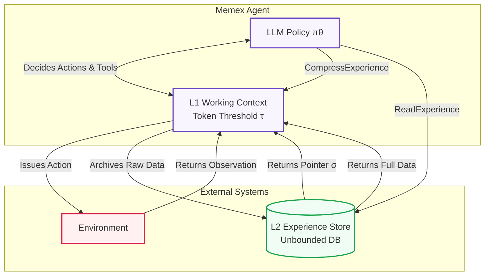

# Memex(RL): Scaling Long-Horizon LLM Agents via Indexed Experience Memory

This repository contains the complete implementation of the **Memex(RL)** architecture, as described in [Wang et al., 2026 (arXiv:2603.04257)](https://arxiv.org/abs/2603.04257). 

Memex(RL) resolves the context window bottleneck inherent to long-horizon Large Language Model (LLM) agents by introducing a two-tiered memory architecture consisting of a working context (L1) and an external Indexed Experience Memory store (L2). The system is trained end-to-end via Group Relative Policy Optimization (GRPO) to jointly learn compression, indexing, and retrieval policies.

## Key Features

* **Apple Silicon Support**: Native MLX integration for local LoRA training on M-series Macs.
* **Bounded Context**: Agent autonomously manages memory via deduplicated L2 storage, preventing context window exhaustion on long trajectories.
* **Outcome-Based GRPO**: Implementation of Group Relative Policy Optimization trained entirely on terminal outcomes and structural penalties, requiring no human preference labels.
* **Non-Destructive Fine-Tuning**: Uses low-rank adapters to train memory operation policies without modifying base model weights.
* **Extensible Architecture**: Hardware, environments, LLM backends (OpenAI/MLX/Ollama), and reward functions are modular.

## Table of Contents
1. [Architecture Overview](#architecture-overview)
2. [Component Specifications](#component-specifications)
3. [Training Methodology (MemexRL)](#training-methodology-memexrl)
4. [Installation and Requirements](#installation-and-requirements)
5. [Usage and Integration](#usage-and-integration)
6. [Testing and Verification](#testing-and-verification)
7. [Repository Structure](#repository-structure)
8. [Citation](#citation)

---

## Architecture Overview

LLM agents operating over extended environments (e.g., operating systems, deep file hierarchies, prolonged interactions) inevitably exceed their maximum context window. Standard truncation or rolling summarization strategies result in irreversible loss of high-fidelity episodic details.

Memex(RL) addresses this through a dual-memory system that mirrors modern operating system virtual memory paradigms:

### Visual Architecture



* **L1 Working Context ($M_{work}$):** Maintained strictly below a predefined token threshold $\tau$. Contains the system prompt, current task instruction, recent step history, and the highly compressed Indexed Summary $\sigma = (s, I)$.
* **L2 Experience Store ($D$):** An unbounded, deduplicated Key-Value store where arbitrary environment observations and historical reasoning are archived.

Memory operations are formulated as environment-independent tools invoked by the agent:
1. `CompressExperience(summary, db_blocks)`: Archives raw context into $D$, reducing $M_{work}$ to $[m_0, u, \sigma]$.
2. `ReadExperience(db_index)`: Dereferences an index pointer $i \in I$ from $D$, injecting the precise high-fidelity artifact back into $M_{work}$.

---

## Component Specifications

This implementation faithfully reproduces the algorithms and structures defined in the primary manuscript.

### 1. Indexed Summary Representation
The core data structure is the Indexed Summary $\sigma = (s, I)$, where:
* `s` represents the abstract, actionable progress state.
* `I` is a set of pointers `(index, description)` mapping to the L2 store.

This mechanism forces the agent to compress spatial and temporal information while retaining $O(1)$ access pointers to the exact evidence via textual anchors.

### 2. The Agent Loop (Algorithm 1)
Implemented in `src/agent/loop.py`. The agent execution loop enforces deterministic context tracking by injecting a `ContextStatus` message at step $t$:
$$ContextStatus(M_t, \tau) = [working\_tokens, total\_tokens, threshold]$$
This dynamic feedback signal is critical for the agent to learn the optimal policy for `CompressExperience` invocations.

### 3. Execution Environments
The repository implements two primary evaluation environments:
* **Modified ALFWorld (Section 4.1):** Integrates four targeted modifications to mandate memory utilization over heuristic search: hidden admissible commands, hidden initial observations, single-use `look` commands per location, and automatic observation truncation.
* **1000-Document Stress Test (Section 4.3):** A custom simulated hierarchical filesystem containing $10^3$ documents, structured specifically to exhaust standard 8K-32K context windows and evaluate the agent's ability to recursively search, compress, and synthesize findings across boundaries.

---

## Training Methodology (MemexRL)

The Memex agent is optimized via GRPO, leveraging a reward function specifically constructed to penalize context violations and format errors without relying on intermediate human annotations.

### 1. The Reward Formulation (Equation 1)
Implemented in `src/training/rewards.py`. The terminal reward for a completed trajectory is defined as:
$$\mathcal{R} = R_{task} - \alpha_1 P_{context} - \alpha_2 P_{redundancy} - \alpha_3 P_{format}$$

Where:
* $R_{task} \in \{0, 1\}$ evaluates final task success.
* $P_{context} = \min\left(1, \frac{\sum \max(0, C_t - \tau)}{\tau \cdot T}\right)$ penalizes context working frames that exceed threshold $\tau$.
* $P_{redundancy} = \frac{N_{redundant}}{N_{tool\_calls}}$ penalizes recurrent state traversals without memory mutation.
* $P_{format} = \frac{N_{malformed}}{N_{tool\_calls}}$ penalizes deviations from the strict XML tool invocation schema.

### 2. Group Relative Policy Optimization (GRPO)
The optimization framework generates $G$ independent rollouts per prompt. The loss objective (implemented in `src/training/grpo.py`) computes a normalized group-relative advantage $\hat{A}$ mapped across segmented trajectory slices:
$$\mathcal{J}_{GRPO}(\theta) = \mathbb{E}\left[ \min\left( \frac{\pi_\theta}{\pi_{ref}} \hat{A}, \text{clip}\left(\frac{\pi_\theta}{\pi_{ref}}, 1 - \epsilon, 1 + \epsilon\right) \hat{A} \right) - \lambda \mathbb{D}_{KL}(\pi_\theta || \pi_{ref}) \right]$$
Trajectories are sliced precisely at `CompressExperience` invocations to preserve markovian state guarantees within each segment.

### 3. Verified Results

Evaluated on the 1,000-document stress test (`qwen2.5:3b`, Apple Silicon M3):

| Setup | Success Rate | Avg Steps | Avg Return |
|---|---|---|---|
| Baseline (zero-shot via Ollama) | 40% (2/5) | 8.6 | 0.36 |
| LoRA fine-tuned (200 iters, 5 golden trajectories) | 80% (4/5) | 7.0 | 0.80 |

Training loss: 2.877 → 0.004 over 200 iterations. Peak memory: 17.1 GB. Trainable parameters: 0.205M (0.007% of model).

---

## Installation and Requirements

### Hardware Requirements
To run inference and training locally:
* **Inference (Ollama)**: Minimum 8GB RAM for 3B parameter models (`qwen2.5:3b`).
* **SFT Generation**: Minimum 8GB RAM.
* **GRPO / LoRA Training (MLX)**: Apple Silicon Mac (M1/M2/M3/M4) with minimum 16GB Unified Memory. Training the 3B model locally consumes ~17GB peak memory. Not currently configured for CUDA/Nvidia GPUs out of the box, though PyTorch/vLLM backend adaptations are possible.

### Setup

The framework is built for Python 3.12+ and minimizes bloated dependencies, focusing only on the core requirements for LLM inference and evaluation.

```bash
# Clone the repository
git clone https://github.com/your-org/memex_rl.git
cd memex_rl

# Core dependencies (Agent framework and local inference)
pip install -e .

# Full installation including evaluation environments (ALFWorld)
pip install -e ".[alfworld]"

# Training dependencies
pip install -e ".[training]"
```

---

## Usage and Integration

### Local Agent Evaluation
You can run the Memex agent entirely locally on your Mac/PC using Ollama. (Tested successfully on Apple Silicon M3 with `qwen2.5:3b`).

**1. Start Ollama and pull a model:**
```bash
ollama run qwen2.5:3b
```

**2. Run the Stress Test Environment:**
The stress test drops the agent into a 1,000-document nested directory. The agent must discover the layout, aggressively compress its findings into L2 memory to avoid context overflow, and use `grep/cat` to locate the target.

```bash
python scripts/run_agent.py --env stress_test --model qwen2.5:3b \
    --base-url "http://localhost:11434/v1" \
    --threshold 8000
```

Execute an ALFWorld trajectory:
```bash
python scripts/run_agent.py \
    --env alfworld \
    --task "put clean butterknife on diningtable" \
    --threshold 8000
```

### Configuration Overrides
Execution parameters are managed categorically in yaml specifications within `configs/`. Sub-parameters (context window bounds, penalty coefficients, inference temperatures) parse via dictionary overrides defined in `default.yaml`, `alfworld.yaml`, and `training.yaml`.

### End-to-End LoRA Training (Apple Silicon)

**1. Collect SFT data** — runs the agent, keeps only successful trajectories with zero format penalties:
```bash
python scripts/generate_sft_data.py \
    --env stress_test --model qwen2.5:3b --num-episodes 50
```

**2. Convert to MLX format:**
```bash
python scripts/convert_sft_to_mlx.py \
    --input data/sft_trajectories.jsonl --output data/mlx_lora_data
```

**3. LoRA fine-tuning:**
```bash
python -m mlx_lm lora \
    --model Qwen/Qwen2.5-3B-Instruct \
    --train --data data/mlx_lora_data \
    --fine-tune-type lora --num-layers 4 \
    --batch-size 1 --iters 200 \
    --learning-rate 1e-5 --max-seq-length 4096 \
    --adapter-path checkpoints --save-every 200
```

**4. Evaluate with trained adapters:**
```bash
python scripts/evaluate_lora.py \
    --model Qwen/Qwen2.5-3B-Instruct \
    --adapter checkpoints/adapters.safetensors --num-tasks 5
```

---

## Testing and Verification

The repository enforces strict coverage standards via the `pytest` suite. The test coverage validates all core mechanics: semantic deduplication in the L2 store, anchor extraction integrity, token boundary management, and exact replica mathematical constraints for the GRPO loss/reward functions.

```bash
# Execute the comprehensive test suite
# (No external LLM dependencies required for the base suite)
python -m pytest tests/ -v
```

---

## Repository Structure

```text
memex_rl/
├── configs/                  # Policy, Environment, and Training YAML definitions
├── scripts/                  # Execution and Evaluation CLI entrypoints
├── src/
│   ├── agent/                # Memex algorithm, XML parsing constraint checks, Protocol semantics
│   ├── environments/         # State definitions, ALFWorld modulations, Stress tests
│   ├── llm/                  # Asynchronous / Synchronous Model API abstractions
│   ├── memory/               # L1 Controller, L2 SHA-256 KV Store, Tiktoken analyzers
│   ├── models/               # Pydantic rigorous type formulations
│   └── training/             # Evaluator metrics, GRPO loss, Trajectory segmentation
└── tests/                    # Implementation verification and invariant constraints
```

---

## Future Work

* **vLLM/PyTorch Integration**: Backend support for CUDA environments.
* **Contrastive Preprocessing**: Pre-filtering L2 pointers using lightweight embedding matrices before LLM consumption.
* **Shared Memory**: Allowing independent agents to query a centralized L2 experience store.

---

## Citation

To cite this framework in academic publications:

```bibtex
@article{wang2026memexrl,
  title={Memex(RL): Scaling Long-Horizon LLM Agents via Indexed Experience Memory},
  author={Wang, et al.},
  journal={arXiv preprint arXiv:2603.04257},
  year={2026}
}
```

## License

This project is licensed under the MIT License. See the `LICENSE` file for details.
